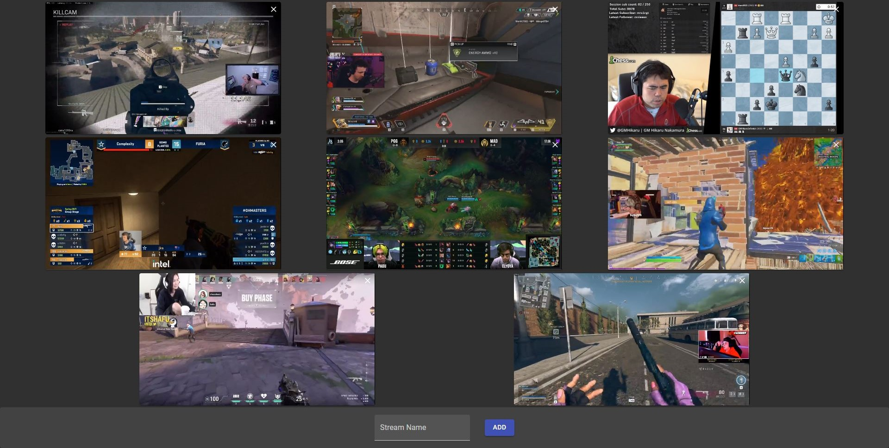

# Multi-Twitch :tv:
A minimalist app for viewing multiple Twitch streams.

## About


Multi-Twitch is an app that enables the user to watch multiple Twitch streams in grid layout (vaguely inspired by Zoom). It has a minimalist design and is extremely simple to use.

## Usage

### Option 1 - Hosted
I am currently hosting Multi-Twitch on my personal [website](https://www.dyscott.xyz/projects/multi-twitch).

### Option 2 - Development Server

Run the following command (assuming you have NPM installed):

```npm run start```

### Option 3 - Self-Host

1. Build using the following command: `npm run build`

2. Host the files in the folder `/build` using your choice of web server.

## Details

Here are some note-worthy details about the app:
- Built in [React](https://reactjs.org/) using [Material UI](https://material-ui.com/) for UI (my first time using React).
- Uses [rect-scaler](https://github.com/fzembow/rect-scaler) to calculate the most efficient layout based on screen size and the number of streams.
- Uses [react-twitch-embed](https://github.com/moonstar-x/react-twitch-embed) to display streams. 

## Improvements
This is primarily a proof-of-concept, so there is a lot of room for improvement:

- [ ] Layout adjustments. Currently, the way columns are spaced out feels a bit off.
- [ ] More testing. There might be bugs, although I haven't run into any.
- [ ] Chat. Currently, there is no way to display chat. This could be added as an option.
